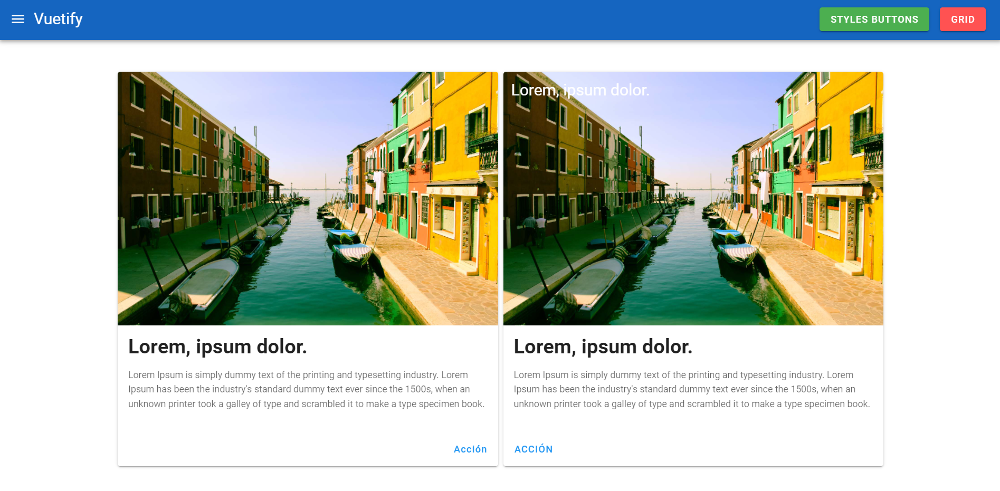
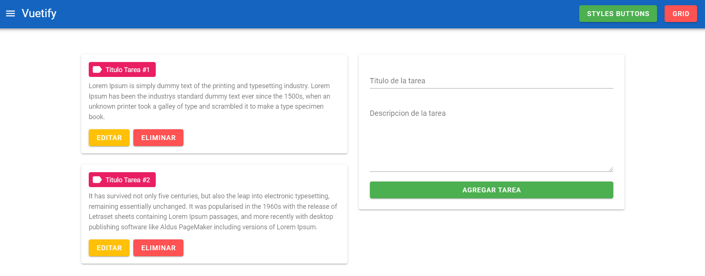
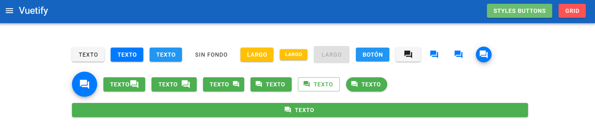

<p align="center"></p>

<h1>Vue Vuetify CRUD</h1>

## Project setup
```
yarn install
```

### Compiles and hot-reloads for development
```
yarn serve
```

<p align="center"></p>
<br>
<p align="center"></p>
<br>
<p align="center"></p>
